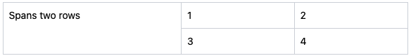

# Data Grid

The <DataGrid> component renders a generic grid (table, matrix, etc.) of data that allows row and column spans. This component uses the CSS grid feature rather than HTML tables.
<br>
<br>

## Data Format

You must format the data for the grid (henceforth referred to as “data-grid format”) as an array of objects in this high-level form:

```
[
  { data for first row of the grid },
  { data for second row of the grid },
  ...
]
```

Define each row's data object this way:

```
{
  id: "unique ID for each row; used as React key",
  cells: [
    { data for first cell in the row },
    { data for second cell in the row },
    ...
  ],
}
```

Define each cell's data object this way:

```
{
  id: "unique ID for each cell within a row; used as React key",
  content: content of the cell,
}
```

The cell `id` must have a unique value only within a single row. Cells on different rows can have the same `id` value.

The `content` of a cell can comprise a string, a number, a JSX element, React component, or function. Pass any data in any props you need to your own React components. This shows an example of a two-by-two grid in data-grid format.

```javascript
[
  {
    id: "first-row",
    cells: [
      { id: "first-cell", content: "1" },
      { id: "second-cell", content: <div>2</div> },
    ],
  },
  {
    id: "second-row",
    cells: [
      { id: "first-cell", content: <ExampleCellComponent data={1} />,
      {
        id: "second-cell",
        content: (cell, meta) => <div style={{ color: `${meta.color}` }}>2</div>,
      },
    ],
  },
]
```

If you set `content` to a function, it receives as arguments the cell object it belongs to, as well as the `meta` object passed to `DataGrid`.
<br>
<br>

## Column Spans

Individual cells can span multiple columns using the `columns` property as a third, optional property on a cell object:

```javascript
cells: [
  { id: "normal-cell", content: "1" },
  { id: "three-column-cell", content: "2", columns: 3 },
];
```

<br>
<br>

## Row Spans

A row can span multiple rows using a `children` property that itself contains multiple rows, such as the following example that has two rows and three columns, with the first column spanning two rows. You can tell how many rows the first column spans because it has two row entries in its `children` array.

```javascript
const dataGridFormat = [
  {
    id: "two-row-span",
    cells: [{ id: "span-cell", content: "Spans two rows" }],
    children: [
      {
        id: "first-sub-row",
        cells: [
          { id: "sub-row-cell-1", content: "1" },
          { id: "sub-row-cell-2", content: "2" },
        ],
      },
      {
        id: "second-sub-row",
        cells: [
          { id: "sub-row-cell-1", content: "3" },
          { id: "sub-row-cell-2", content: "4" },
        ],
      },
    ],
  },
];
```

This produces a grid that looks like:


<br>
<br>

## Row Components

Custom React components can render individual cells as seen above, but you can define a single component that renders each cell within an entire row through the `RowComponent` property of a row object, as in this single-row data-grid format array:

```javascript
[
...
  {
    id: "header-row",
    cells: [
      { id: "header-left", content: "Left" },
      { id: "header-right", content: "Right" },
    ],
    RowComponent: HeaderRowComponent,
  },
...
]
```

`RowComponent` receives several props to help it render data. This shows an example `RowComponent` React component:

---

**rowId** {string}

`id` property of the row or child row this component renders

---

**cells** {array}

`cells` property of the current row, giving this component access to all cells within the row.

---

**cellIndex** {number}

Zero-based index into `cells` of the currently rendering cell.

---

**meta** {object}

`meta` object passed to `DataGrid`.

---

**children**

Contents of each cell.

---

```javascript
const CustomHeaderRowComponent = ({
  rowId,
  cells,
  cellIndex,
  meta,
  children,
}) => {
  const cellContent = cells[cellIndex]
  return <div>{cellContent.content}</div>
}
...
  {
    id: "header-row",
    cells: [
      { id: "header-left", content: "Left" },
      { id: "header-right", content: "Right" },
    ],
    RowComponent: CustomHeaderRowComponent,
  },
...
```

<br>
<br>

## Cell Roles

You can add a `role` to a cell object to pass a special role to any particular cell. By default, every cell gets the role `cell`, but you can override that with the `role` property.

```javascript
...
    cells: [
      { id: "header-left", content: "Left", role: "columnheader" },
      { id: "header-right", content: "Right" },
    ],
...

  <div style="grid-row: 1 / 3; grid-column: 1 / 2">
    <div class="flex h-full w-full bg-white p-2 dark:bg-gray-900", role="columnheader">
      Left
    </div>
  </div>
  <div style="grid-row: 1 / 2; grid-column: 2 / 3">
    <div class="flex h-full w-full bg-white p-2 dark:bg-gray-900", role="cell">
      Right
    </div>
  </div>
```

<br>
<br>

## Whole-Grid Components

By default every cell in the data grid gets rendered with the `DefaultCell` component, overrideable on a cell or row basis. If you have specific requirements for a default cell for most of your data grid, you can define that component and pass it in the `CellComponent` property to `DataGrid`. It should expect a single `children` property for it to render in whatever wrapper it needs.
<br>
<br>

## Typical Usage

You normally pass only the `data` property to the `DataGrid` component, containing your data-grid format array. You should also wrap `<DataGrid data={data} />` in a `<div>` that sets up the borders and background. You likely need a border on this wrapper, and fill it with a background color to peek through the gaps between the cells. You can use the `DataGridContainer` component to do this, or you can supply your own that does something similar.

```javascript
return (
  <DataGridContainer>
    <DataGrid data={data} />
  </DataGridContainer>
);
```
