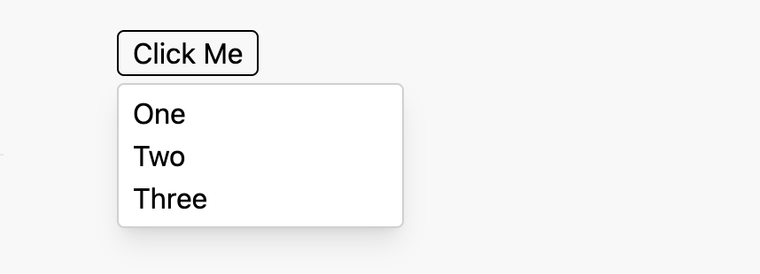

# Dropdown Module

This module lets you have a button that, when clicked, shows a dropdown panel — often a menu of options. The user can then make a selection in the dropdown that then closes the dropdown.

This dropdown appears either below or above the button depending on which side has more space within the browser window. You can specify whether the dropdown appears left aligned or right aligned to the button.

## Basic Usage

At minimum, import and use three things from the dropdown.js module:

1. `useDropdown` custom hook
1. `<DropdownRef>` component that wraps around a button used to make the dropdown appear
1. `<Dropdown>` wrapper that appears when the user clicks the button

The button (or some other type of element) that the user clicks to make the dropdown appear is called the “dropdown ref.” The dropdown itself is simply called the “dropdown.”

The following shows a basic example. Notice you don’t pass an `onClick` handler to this button — its click handler gets set by the parent `<DropdownRef>`.

```javascript
function DropdownExampleComponent() {
  const dropdownAttr = useDropdown("dropdown-id");
  const sampleData = ["One", "Two", "Three"];

  return (
    <>
      <DropdownRef dropdownAttr={dropdownAttr}>
        <button className="rounded border border-black px-2">Click Me</button>
      </DropdownRef>
      <Dropdown dropdownAttr={dropdownAttr}>
        <div className="min-w-40 px-2 py-1">
          {sampleData.map((item) => (
            <div key={item}>{item}</div>
          ))}
        </div>
      </Dropdown>
    </>
  );
}
```

This produces the following after the user clicks the “Click Me” button.



## Dropdown Attributes

The `useDropdown` custom hook returns an object that usually gets called `dropdownAttr`. It ties a dropdown ref to its dropdown. Create this object with `useDropdown()`, then pass this object in the `dropdownAttr` property of a `<DropdownRef>` wrapper, and the same object to a `<Dropdown>` wrapper, and that dropdown appears when the user clicks the dropdown ref. If you have more than one dropdown within a parent component, call `useDropdown` for each dropdown/dropdown-ref pair.

Only the dropdown components themselves as well as the [floating-ui](https://floating-ui.com) package should maintain the `dropdownAttr` object and its properties. Client code should treat `dropdownAttr` as immutable and atomic — with the exception of the `isVisible` property. Clients can read `dropdownAttr.isVisible` to see if the dropdown is visible or not, and can set `dropdownAttr.isVisible` to true or false to make the dropdown visible or not. In this contrived example, we create a `dropdownAttr` object, then do something whenever the dropdown is visible. The dropdown itself just contains a button that makes the dropdown become invisible when the user clicks it.

```javascript
const dropdownAttr = useDropdown("example");

if (dropdownAttr.isVisible) {
  … do something …
}

return (
  <DropdownRef dropdownAttr={dropdownAttr}>
    <button>Trigger</button>
  </DropdownRef>
  <Dropdown>
    <div>
      <button onClick={() => { dropdownAttr.isVisible = false; }}>
    </div>
  </Dropdown>
)
```

## Dropdown Portal Root

While the dropdown ref appears in the HTML wherever you place it in your JSX, the same does _not_ apply to the dropdown. Its HTML instead gets injected into a `<div>` with the static HTML `id` of `dropdown-portal-root`. This `<div>` doesn’t automatically appear — you have to place that `<div>` using the `<DropdownPortalRoot>` component described below.

This module does this for two reasons:

1. Because the dropdown HTML gets injected after the HTML for most other page elements, the dropdown ends up in front of all other elements on the page, instead of accidentally ending up behind another element. This way you don’t have to deal with a `z-index` CSS, which often doesn’t help for this situation anyway.
1. Placing the dropdown HTML within a small parent element limits the size of the dropdown to the size of the parent element. By instead putting it at the top level within the `<body>` element, it gets placed with complete freedom on the page, using whatever width is needed to hold your content.

## API

### `useDropdown(id, alignment)`

Call this custom hook once for each dropdown/dropdown-ref pair. It creates a `dropdownAttr` object that you pass in the `dropdownAttr` property of each `<DropdownRef>` as well as its corresponding `<Dropdown>`.

#### **`id` : string** (required)

Pass an HTML-style ID string that’s unique on the page. The `<Dropdown>` wrapper `<div>` uses this string as its HTML `id` attribute. The `<DropdownRef>` component uses this string appended with `-ref` as its HTML `id` attributes.

#### **`alignment` : string** (optional)

By default the left edge of the dropdown appears aligned with the left edge of the dropdown ref. If you want the right edges aligned, you can specify that with this parameter. Don’t pass an arbitrary value here or the page could crash. Instead, import the following constants from dropdown.js, and pass either in this parameter:

| Constant               | Meaning                    |
| ---------------------- | -------------------------- |
| `DROPDOWN_ALIGN_LEFT`  | Align left sides (default) |
| `DROPDOWN_ALIGN_RIGHT` | Align right sides          |

#### Examples

```javascript
const dropdownAttr = useDropdown("selection-control");
```

```javascript
const dropdownAttr = useDropdown(
  "right-selection-control",
  DROPDOWN_ALIGN_RIGHT
);
```

### `<DropdownRef>`…`</DropdownRef>`

Wrap your button (not necessarily a button, but buttons make a natural trigger for the dropdown) within this component.

#### **`dropdownAttr` : object** (required)

Pass the object returned by `useDropdown()` in this property.

#### **`type`: string** (optional)

This sets the [`aria-haspopup`](https://developer.mozilla.org/en-US/docs/Web/Accessibility/ARIA/Attributes/aria-haspopup#values) value on the dropdown ref. Don’t pass an arbitrary value or the console displays a propType warning on development-mode builds. Instead, import any of the following constants.

| Constant              | Corresponding `aria-haspopup` value |
| --------------------- | ----------------------------------- |
| DROPDOWN_TYPE_TRUE    | true (default)                      |
| DROPDOWN_TYPE_MENU    | menu                                |
| DROPDOWN_TYPE_LISTBOX | listbox                             |
| DROPDOWN_TYPE_TREE    | tree                                |
| DROPDOWN_TYPE_GRID    | grid                                |
| DROPDOWN_TYPE_DIALOG  | dialog                              |

#### Examples

```javascript
const dropdownAttr = useDropdown("example");

return (
  <DropdownRef dropdownAttr={dropdownAttr}>
    <button>Example Dropdown</button>
  </DropdownRef>
);
```

```javascript
import { DROPDOWN_TYPE_LISTBOX } from "./dropdown";

const dropdownAttr = useDropdown("example");

return (
  <DropdownRef dropdownAttr={dropdownAttr} type={DROPDOWN_TYPE_LISTBOX}>
    <button>List Dropdown</button>
  </DropdownRef>
);
```

### `<Dropdown>`…`</Dropdown>`

Wrap the content of your dropdown within this component. This content can be anything, but you commonly see a scrolling menu of options.

#### **`dropdownAttr` : object** (required)

Pass the object returned by `useDropdown()` in this property.

#### **`className` : object** (optional)

If you pass Tailwind CSS classes in this property, it overrides the default styling of the dropdown. By default a rounded-corner panel appears here with a border and shadow. You can use any styling you want with this property.

#### Examples

```javascript
const dropdownAttr = useDropdown("example");

return (
  <DropdownRef dropdownAttr={dropdownAttr} type={DROPDOWN_TYPE_LISTBOX}>
    <button>List Dropdown</button>
  </DropdownRef>
  <Dropdown dropdownAttr={dropdownAttr} className="border border-black bg-white">
    <div className="w-64 h-56">
      … generate data …
    </div>
  </Dropdown>
);
```

### `<DropdownPortalRoot />`

This component places the dropdown portal root `<div>` in your HTML. While the dropdown ref appears in your HTML where it appears in your JSX, the dropdown does _not_ appear in the HTML where you place it. Instead, it appears inside a `<div>` with the HTML `id` of `dropdown-portal-root`. To avoid hard-coding the `id` value within your JSX, just put `<DropdownPortalRoot />` in your JSX at the top level within your `<body>` tag, preferably as close to the terminating `</body>` tag as possible. In a NextJS project, this probably happens in the \_document.js file.
