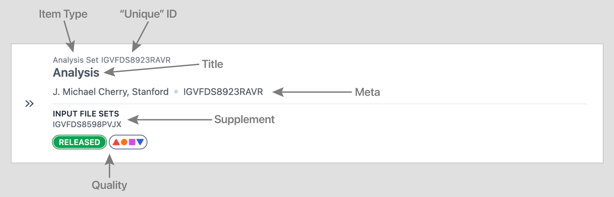

# Writing Search-List Item Renderer Components

These components render each of the items that appear when you go to the `/search` path. Each item on the resulting list of search results can have a different type, though most often people search for a specific type. For example:

```
/search?type=MeasurementSet
```

The results of this search only contain Measurement set objects. However:

```
/search?query=cherry
```

The results can contain a mix of types, so consider each search-result item as standing independently from the others.

Each item’s first `@type` gets a search-list item renderer React component, though similar types — child types sharing the same parent type for example — can potentially share search-list item renderers.

## Basic Search-List Item Renderer

Search-list item renderers go into the directory:

```
components/search/list-renderer
```

The search-list item renderer component gets called with a single item from the search results. The `@type` of this item determines which search-list item renderer to use.

A generic one looks like this:

```js
export default function GenericRenderer({ item }) {
  return (
    <SearchListItemContent>
      <SearchListItemMain>
        <SearchListItemUniqueId>
          <SearchListItemType item={item} />
          {item.accession}
        </SearchListItemUniqueId>
        <SearchListItemTitle>{item.title}</SearchListItemTitle>
        <SearchListItemMeta>
          <span key="lab">{item.lab.title}</span>
          <span key="summary">{item.summary}</span>
        </SearchListItemMeta>
        {item.supplementItem && (
          <SearchListItemSupplement>
            <SearchListItemSupplementSection>
              <SearchListItemSupplementLabel>
                Example supplement item
              </SearchListItemSupplementLabel>
              <SearchListItemSupplementContent>
                {item.supplementItem.join(", ")}
              </SearchListItemSupplementContent>
            </SearchListItemSupplementSection>
          </SearchListItemSupplement>
        )}
      </SearchListItemMain>
      <SearchListItemQuality item={item} />
    </SearchListItemContent>
  );
}
```

These sections generate this visual:



### Search-List Item Sections

The elements in a search-list item display should help the user quickly identify a specific object. Leave out any data that doesn’t help with this goal.

#### Item Type (automatic)

This helps the user if more than one object type appears in search results. It gets displayed by passing the item’s object to `<SearchListItemType>` which should get wrapped within `<SearchListItemUniqueId>` along with the actual unique ID.

#### “Unique” ID (required)

Display some unique identifier associated with the object. For many object types, the object’s accession often serves this role well. You don’t have to use a truly unique identifier though. The Document type, for example, uses the object’s attachment’s file name as the unique identifier even though multiple document objects can have the same attachment file name. Wrap the text of the unique ID within the `<SearchListItemUniqueId>` component along with the item type.

#### Title (required)

Use a human-readable name that reflects the object or a subset of objects in some way. Think of this as what you would say to a person about the object so that you both know what object or subset of objects you’d like to discuss. Consider using a short summary string, a title for a document or publication, some key properties of the type, etc. For some object types, many objects might share the same title, so you need to provide the user with other elements described in this section to identify a specific object. Wrap the title within the `<SearchListItemTitle>` component. You can, in some unusual cases, also wrap React components within the title, perhaps for an icon or something else not too intrusive nor complicated.

#### Meta (optional)

Provide a small number of short details about an object here. For many objects, the lab title goes here. Also consider an organizational identifier of some kind. Try to keep the items within the meta down to a handful of characters because they all appear on the same line (possibly broken across multiple lines at narrow browser widths), separated by bullets. Attributes containing long strings of text should instead go into the supplement described below. Avoid links in the meta section.

Wrap the elements of the meta section within the `<SearchListItemMeta>` component. Each separate element within meta must have a React key unique within the meta section because `<SearchListItemMeta>` iterates over each item. Wrap each item in a `<span>` instead of a `<div>` so that each item’s text can line break if needed.

#### Supplement (optional)

Use this section for items that don’t necessarily visually fit well in the meta section. You must provide a supplement item with both the item’s data as well as its title. Examples of properties that work better in supplement than they do in meta:

- Long strings, perhaps potentially longer than 20 characters or so.
- Arrays of strings or other types of items
- Items that link to other pages
- Items that don’t have an obvious meaning without a title

You can divide the supplement into multiple sections, each with a label wrapped by the `<SearchListItemSupplementLabel>` component. The content of each section gets wrapped in the `<SearchListItemSupplementContent>` component. Wrap both of these within the `<SearchListItemSupplement>` component.

If the contents of the supplement take up a large portion of the browser window space, consider not displaying them at all — large elements within the search-list results make browsing a large number of results difficult and time consuming for the user. As an example, a list of dozens of linked accessions probably helps no one, and simply takes up a lot of space.

#### Quality (automatic)

The status and any audits in an object get displayed here. Pass the item’s object to the `<SearchListItemQuality>` component to display these. This component handles the display of the audit details panel.

## Attaching Search-List Item Renderers

To have your search-list item renderer called when the item type your renderer handles appear in search results, export your renderer component from its file, likely as the default identifier, e.g.

```js
export default function GenericRenderer({ item }) {
  ...
}
```

Now open the file:

```
components/search/list-renderer/index.js
```

Import your renderer function, then find the `renderers` object below the import section. Each key in this object matches the `@type` of the search-result object to render. If the `@type` corresponding to the type your renderer handles doesn’t exist already, add it in alphabetical order to the `renderers` object. Use your component name as the value for this key, using the [object property/method shorthand](https://ui.dev/shorthand-properties) if you can.

Multiple search-result object `@type` can share the same renderer by using the same renderer name for multiple keys in the `renderer` object.

## Accessory Data

Search-list item renderers sometimes need to display parts of linked objects within a search-result item object. In the following example, you might need to display a property within the linked `feature` property, but the linked phenotype term doesn’t get embedded in search results — you only have the path to the phenotype term object:

```json
{
  "@id": "/phenotypic-features/ae1b4a0b-78e6-af0a-8e6d-c0c9b45905fa/",
  "@type": [
    "PhenotypicFeature",
    "Item"
  ],
  "feature": "/phenotype-terms/NCIT_C92648/",
  "lab": {
    "@id": "/labs/j-michael-cherry/",
    "title": "J. Michael Cherry, Stanford"
  },
  "title": "Example phenotypic feature",
  "status": "released",
  "uuid": "ae1b4a0b-78e6-af0a-8e6d-c0c9b45905fa"
},
```

The following options solve this problem:

- Embed just the linked object’s properties you need, using the mechanism often called “slim embedding.” In the example search-result item above, the `lab` property uses slim embedding to access the `@id` and `title` properties of the larger linked lab object.
- Embed the entire linked object in search results.
- Don’t embed the linked object. Instead, request the linked object from the server-side UI code using the accessory-data mechanism discussed here.

To enable the accessory-data mechanism for a specific search-list object type, add a function called `getAccessoryDataPaths()` as a property to the search-display component. This function receives all search-result item objects displayed on the current page for the type this component handles. This function goes through all these objects and returns the paths of the objects it needs for display. For example, we have this search-list item renderer to display the example object above:

```js
export default function GenericRenderer({ item }) {
  return (
    <SearchListItemContent>
      <SearchListItemMain>
        <SearchListItemUniqueId>
          <SearchListItemType item={item} />
          {item.accession}
        </SearchListItemUniqueId>
        <SearchListItemTitle>{item.title}</SearchListItemTitle>
        <SearchListItemMeta>
          <div key="lab">{item.lab.title}</div>
          <div key="term">{item.feature.term_name}
        </SearchListItemMeta>
      </SearchListItemMain>
      <SearchListItemQuality item={item} />
    </SearchListItemContent>
  );
}
```

Currently, this would display “undefined” for the Feature `term_name` property because the `feature` property just contains the path to the Feature object as a string. To fix this, tell the search-result system the path to the Feature object you need by adding the `getAccessoryDataPaths()` property to your functional component, as well as the specific fields of the Feature object you need. For the `<GenericRenderer>` example:

```js
GenericRenderer.getAccessoryDataPaths = (items) => {
  return [
    {
      type: "Feature",
      paths: items.map((item) => item.feature).filter(Boolean),
      fields: ["term_name"],
    },
  ];
};
```

### Generating Accessory Data Paths

The accessory-data function gets called only on the NextJS server before the browser receives any data, so don’t reference any browser variables in this function. The parameter passes in an array of _all_ results in the search-results object from igvfd that match the `@type` your renderer handles.

As an example, if the `@graph` property of search results contains something like this:

```
[
  {
    "@id": "/generics/AAA",
    "@type": ["Generic", "Item"],
    accession: "IGVF000AAA",
    title: "Title for one result",
    feature: "/feature/001/",
  },
  {
    "@id": "/somethings/100",
    "@type": ["OtherType", "Item"],
    accession: "IGVF001",
    sample: "/samples/CCC",
  },
  {
    "@id": "/generics/BBB",
    @type: ["Generic", "Item"],
    accession: "IGVF000BBB",
    title: "Title for one result",
    feature: "/feature/002/",
  },
]
```

Once the NextJS server receives this search-result data, it discovers that the objects with an `@type` of `Generic` gets rendered by the `<GenericRenderer>` component. It collects just the `Generic` results into a single array and passes that to `GenericRenderer.getAccessoryDataPaths()` -- the OtherType object doesn’t get included, as an array containing that object gets passed to the `getAccessoryDataPaths()` method for the renderer that handles that type, if that method exists.

The `getAccessoryDataPaths()` must then determine the paths to all linked objects needed to render all the search-list items for the `@type` this method handles and return them within an array of objects with this form:

```js
[
  {
    type: "@type of the objects included in the `paths` property",
    paths: [
      "Array of paths to all linked objects matching the `@type` of the `type` property",
    ],
    fields: ["Array of properties needed in the linked objects"],
  },
  {
    type: "@type of other objects needed to render the search results",
    paths: ["Array of paths to those objects"],
    fields: ["Array of properties needed for those objects"],
  },
];
```

In the `getAccessoryDataPaths` method example above, you can see it only needs to retrieve the objects linked from the `feature` property of the search results, and it needs just the `term_name` property of those linked objects. You can include duplicate paths in the `paths` array without causing duplicate requests to the data provider because these paths get deduplicated. This method should remove any undefined elements though.

### Using Accessory Data

Once the search-list processing code gathers all the linked objects returned from all the relevant `getAccessoryDataPaths()` functions, it gathers _all_ these objects into one object and passes that to each of the search-list renderer components. This collective object has `@ids` as keys and the corresponding object as the value. For example:

```
{
  "/phenotypic_feature/001": {
    "@id": "/phenotypic_feature/001",
    "@type": ["PhenotypicFeature", "Item"],
    "notes": "Phenotypic feature of body weight",
    "status": "released",
  },
  "/samples/CCC": {
    "@id": "/samples/CCC",
    "@type": ["Sample", "Item"],
    "accession": "IGVFSM0003DDDD",
  },
  "/phenotypic_feature/002": {
    "@id": "/phenotypic_feature/002",
    "@type": ["PhenotypicFeature", "Item"],
    "notes": "Phenotypic feature of body weight",
    "status": "in progress",
  },
}
```

Your renderer component takes this accessoryData in the `accessoryData` property. You can then use the paths from the linked properties to find the corresponding object within `accessoryData`, for example:

```js
export default function GenericRenderer({ item: generic, accessoryData }) {
  // `generic.feature` still contains the path to the linked object. The corresponding
  // object probably exists in `accessoryData` but expect it not to.
  const feature = accessoryData?.[generic.feature];
  return (
    <SearchListItemContent>
      <SearchListItemMain>
        <SearchListItemUniqueId>
          <SearchListItemType item={generic} />
          {generic.accession}
        </SearchListItemUniqueId>
        <SearchListItemTitle>{generic.title}</SearchListItemTitle>
        {feature && (
          <SearchListItemMeta>
            <div key="lab">{feature.term_name}</div>
          </SearchListItemMeta>
        )}
      </SearchListItemMain>
      <SearchListItemQuality item={generic} />
    </SearchListItemContent>
  );
}
```

Do not assume the `accessoryData` property contains all the objects you requested, as network failures can result in missing objects within it, or even for the `accessoryData` property itself to contain null.
