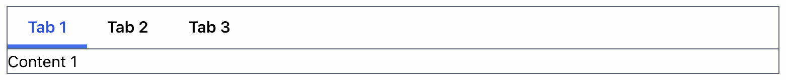

# Tab Module

Use this module when you need a set of tabs that lets the user switch between different content in one section of the page. The following shows a basic three-tab example that allows the user to switch between three different panes of content. You need nothing else for this basic functionality. These tab components handle the user clicking the tabs, highlighting the currently selected tab, and switching to the corresponding content area.

These components also implement a standard tab styling so that all tabs on the site look the same. The tab panes, of course, contain whatever content you need. You can alter the styling to some extent, as documented below.

```javascript
<TabGroup>
  <TabList>
    <TabTitle>Tab 1</TabTitle>
    <TabTitle>Tab 2</TabTitle>
    <TabTitle>Tab 3</TabTitle>
  </TabList>
  <TabPanes>
    <TabPane>Content 1</TabPane>
    <TabPane>Content 2</TabPane>
    <TabPane>Content 3</TabPane>
  </TabPanes>
</TabGroup>
```

Wrap the entire tab complex within a `<TabGroup>` component. The tab titles then go within a
`<TabList>` component, and the corresponding content panes go within a `<TabPanes>` component. This produces the following display, though this example adds borders for clarity:



As the user clicks each tab, the “Content 1” gets replaced by the pane for “Content 2” and “Content 3.” You don’t have to do anything about the clicks for each tab — these tab components handle all of that for you.

## Tab Group

Wrap the entire tab complex — tabs themselves as well as the content they control — within a `<TabGroup>` component. `<TabGroup>` has no required properties, but it has these optional ones:

### TabGroup Properties

#### `onChange` {function}

This callback gets called whenever the user clicks a tab. This tabs module takes care of switching the current content whenever the user clicks a tab, so you often don’t need to use this property. The callback receives the string ID assigned to the clicked tab. The IDs come from the `<TabTitle>` component. Basic usages of this Tab module don’t need IDs on each `<TabTitle>`, but you probably need them if you use the `onChange` property.

Example use of `onChange`.

```javascript
function tabClickHandler(tabId) {
  console.log("Clicked tab:", tabId);
}

return (
  <TabGroup onClick={tabClickHandler}>
    <TabList>
      <TabTitle id="first">First Tab</TabTitle>
      <TabTitle id="second">Second Tab</TabTitle>
    </TabList>
    <TabPanes>...</TabPanes>
  </TabGroup>
);
```

#### `defaultId` {string}

By the default, tab groups appear with the first tab selected on mount. If you instead want a different tab selected, use the `id` property to assign unique IDs to each of the `<TabTitle>` components. Then pass the one you want to appear as the default tab in this `defaultId` property.

#### `className` {string}

Use this property to add Tailwind CSS classes to a wrapper around all the tabs and the content.

## Tab List

Wrap all your `<TabTitle>` components in a single `<TabList>` component that helps manage the mechanics of the tabs so we don’t need to worry about it.

### TabList Properties

#### `className` {string}

Use this property to add Tailwind CSS classes to a wrapper around all the tabs and the content.

## Tab Titles

The example above shows each tab contains a simple string. But you can also use a React component as the title. For example, if you wanted to show icons along with the tab text, you can:

```javascript
<TabList>
  <TabTitle>
    <Icon1 />
    Tab 1
  </TabTitle>
  <TabTitle>
    <Icon2 />
    Tab 2
  </TabTitle>
</TabList>
```

### TabTitle Properties

#### `id` {string}

Unique ID to assign to each tab. You can use this to identify the clicked tab to an `onChange` handler to `<TabGroup>`. You can also use this to specify the default when the tabs mount. If you have neither of these needs, you don’t need to specify the `id` for each tab title.

#### `label` {string}

Used as the `aria-label` for the tab.

#### `isDisabled` {boolean}

True to make this tab non-clickable, and to appear differently from clickable tabs. More Information below under “Disabling Tabs.”

#### `className` {string}

Tailwind CSS classes to use in a wrapper around the child `<TabTitle>` component.

## Disabling Tabs

You can disable specific tabs so that they don’t react to clicks by passing the `isDisabled` property to `<TabTitle>`. By default, disabled tabs appear grayed out. The following example shows how to disable the second tab. The parent component needs to keep track of the disabled tabs.

```javascript
<TabList>
  <TabTitle>Tab 1</TabTitle>
  <TabTitle isDisabled>Tab 2</TabTitle>
  <TabTitle>Tab 3</TabTitle>
</TabList>
```

## Rendering Custom Selected and Disabled Tabs

The user selects exactly one tab at a time. By default, the selected tab text appears blue and a thick blue border appears below it, while the non-selected tab text appears black and no border appears below them. You don’t need to add any code to make this happen -- this happens automatically when you use simple strings as tab titles.

You can make a custom tab title sensitive to the selected and disabled states by passing a function as the child of the `<TabTitle>` component. The following contrived example has its third tab draw in bold while the user has selected it. It draws an asterisk instead of the number “3” if the parent has disabled it.

```javascript
<TabList>
  <TabTitle>Tab 1</TabTitle>
  <TabTitle>Tab 3</TabTitle>
  <TabTitle isDisabled>
    {({ selected, isDisabled }) => (
      <>
        {selected ? (
          <span className="font-extrabold">Tab 3</span>
        ) : (
          <span>Tab {isDisabled ? "*" : "3"}</span>
        )}
      </>
    )}
  </TabTitle>
</TabList>
```

This `<TabTitle>` component’s child is a function instead of a string or React component. This function receives an object with two properties:

- `selected` — True if the user has selected this tab
- `disabled` — True if the parent component has disabled this tab.

`<TabTitle>` always passes this object to the child component, but in most cases the child component doesn’t need them. Implement the child as a function only if your custom tab renderer needs to render itself differently for either or both of these states.
