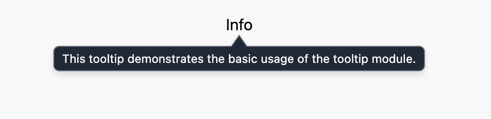

# Tooltip Module

This module lets you have an element on the page that shows a pop-up tooltip as long as the user hovers over that element. Once they move the mouse off that element, the tooltip disappears. The element that triggers the tooltip when the user hovers over it is called the “Tooltip Ref,” for “tooltip reference element.”

## Basic Usage

You need to import and use three things from the tooltip.js module:

1. The `useTooltip` custom hook
1. The `<TooltipRef>` element wrapper that the user can hover over
1. The `<Tooltip>` element wrapper that only appears while the user hovers over the `<TooltipRef>` element.

The following shows a basic example:

```javascript
import { Tooltip, TooltipRef, useTooltip } from "./tooltip";

function TooltipExampleComponent() {
  const tooltipAttr = useTooltip("tooltip-id");

  return (
    <>
      <TooltipRef tooltipAttr={tooltipAttr}>
        <button>Info</button>
      </TooltipRef>
      <Tooltip tooltipAttr={tooltipAttr}>
        This tooltip demonstrates the basic usage of the tooltip module.
      </Tooltip>
    </>
  );
}
```

This produces the following when the user hovers over the “Info” text:



## Tooltip Attributes

The `useTooltip` custom hook returns an object that usually gets called `tooltipAttr`. It ties a tooltip ref to its tooltip. Pass this object in the `tooltipAttr` property of a `<TooltipRef>` wrapper, and the same object to a `<Tooltip>` wrapper, and that tooltip appears when the user hovers over the tooltip ref. If you have more than one tooltip within a parent component, call `useTooltip` for each tooltip/tooltip-ref pair.

## Tooltip ID

`useTooltip` has one required parameter: the tooltip ID string. This gets used as the `id` property of the tooltip wrapper HTML element. If you need to debug tooltips, the wrapper element gets the `id` property value `tooltip-` followed by the ID argument you passed to `useTooltip`. In the above example with the “tooltip-id” argument to `useTooltip`, you see the attribute `id="tooltip-tooltip-id` in the HTML.

## TooltipRef Wrapper

Only include one child element to the `<TooltipRef>` wrapper. If you use multiple children, like:

```javascript
<TooltipRef tooltipAttr={tooltipAttr}>
  <button>First Child</button>
  <Link href="#">Second Child</button>
</TooltipRef>
```

This results in a build-time error. If you need something like this, you must use a `<div>` or React fragment to wrap these children:

```javascript
<TooltipRef tooltipAttr={tooltipAttr}>
  <>
    <button>First Child</button>
    <Link href="#">Second Child</button>
  </>
</TooltipRef>
```

Generally, a single simple element works best as a tooltip ref child.

A button makes the best child of `<TooltipRef>`. This lets people who use screen readers to tab to the tooltip ref and have the tooltip text read to them. You don’t need to assign a click handler to this button.

If you have a link as the tooltip-ref child, make sure the tooltip text mentions that the user can click this link so that people using screen readers understand this. You can include clickable elements within the tooltip, but this can cause [accessibility issues](https://developer.mozilla.org/en-US/docs/Web/Accessibility/ARIA/Roles/tooltip_role#description).

## Tooltip Wrapper

You can put any number of HTML elements and React Components as children of the `<Tooltip>` wrapper. Tooltips generally display simple text though, so try to keep it simple.

## Tooltip Hover Delay

You don’t see a tooltip _immediately_ when the mouse passes over a `<TooltipRef>` element — you have to linger your mouse over the tooltip ref for a moment before it appears. That prevents having the tooltip appear for an instant just because the user happened to pass their mouse over a tooltip ref. Tooltips only appear when the user deliberately hovers over the tooltip ref.

Similarly, the tooltip doesn’t _immediately_ disappear after the user moves their mouse off of the tooltip ref — it takes a moment to disappear. That lets the user keep the tooltip open as they pass their mouse over its contents, which lets them copy the text if they would like to. It also allows them to click a link or button that appears within the tooltip, though this causes accessibility issues so this generally [gets frowned upon](https://developer.mozilla.org/en-US/docs/Web/Accessibility/ARIA/Roles/tooltip_role#description).
