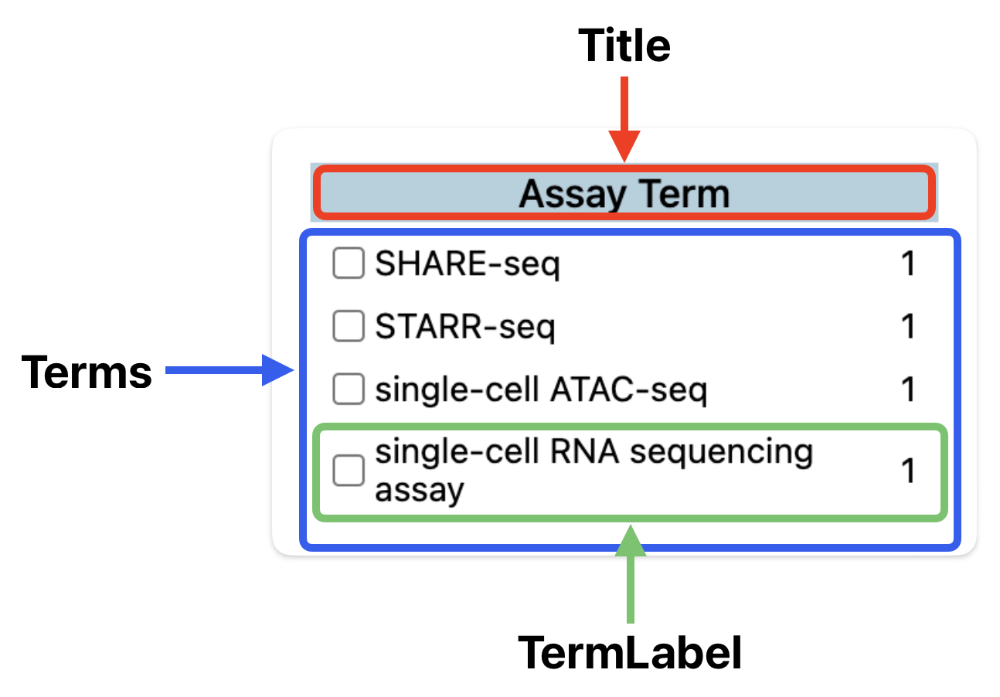

# Custom Facets

You can customize the appearance of specific portions of a facet, or the appearance and functioning of an entire facet. The result of the user interactions with any custom facet is a query string to use to navigate to the next filtered set of search results.

The portions of a facet you can customize include:

- **Title** — This lets you customize the title of the facet. This usually comes from the `title` property of a facet object in the search result, but can come from anywhere in your custom facet title component.

- **Terms** — This lets you customize both how a facet appears and how it works. With this mechanism, you can make a facet work in any way you’d like, as long as an updated query string results from the user interacting with your custom facet. Examples of a custom facet terms component include, but certainly not limited to:
  - Dropdown — Selecting an item in a dropdown adds or replaces a relevant query-string element.
  - Radio Buttons — Choosing a radio button adds or replaces a relevant query-string element.
  - Date Picker — The user picks a date to add to the query string, or perhaps a range of dates.
  - Boolean — The facet could comprise a label with an iOS-style switch or checkbox that adds or subtracts a query-string element, or sets a query-string element to one of two values.

- **TermLabel** — This lets you customize the appearance of the label and search-result count in a standard checkbox facet.



<a name="scope"></a>

## Scope

Each custom facet component works with one or more specific facet fields. For example, you might want the `taxa` facet to display each organism species in italic instead of the standard normal text, but to not affect any other facet. Because this facet would otherwise look and work like a standard facet, you can implement this as a custom TermLabel facet component.

The field value you need to connect to is `taxa`, as you would find in the `field` property of one facet of the `facets` array in the search results:

```javascript
"facets": [
...
  {
    "field": "taxa",
    "title": "Taxa",
    "terms": [
      {
        "key": "Homo sapiens",
        "doc_count": 4
      }
    ],
    "total": 4,
  },
...
]
```

Place your custom TermLabel component in a file in components/facets/custom-facets following the naming convention of files already there, then open components/facets/facet-registry.js. Find the `facetRegistry` object and, within it, find the `termLabel` object. Add the field value, `taxa` as the key, and your custom TermLabel component as its value. You of course also have to import your TermLabel component.

You can have multiple facet field values use your TermLabel component by having multiple keys all use your component as their value.

For Terms and Title custom facet components, the same things apply. You simply plug them into the `terms` and `title` objects in the facet registry, and use the facet field value to connect them.

## Implementing a Custom TermLabel Facet Component

The simplest custom facet component is the TermLabel. Your component only gets passed a single `term` object from the `terms` array within a a facet object within the `facets` array. In the `taxa` example above, the custom TermList component would receive:

```javascript
{
  "key": "Homo sapiens",
  "doc_count": 4
}
```

Your custom TermLabel component can then use the `key` and `doc_count` properties to display a term, like this:

```jsx
export default function TaxaTermLabel({ term }) {
  return (
    <div className="flex grow items-center justify-between gap-2 text-sm leading-[1.1] font-normal">
      <div className="italic">{term.key}</div>
      <div>{term.doc_count}</div>
    </div>
  );
}
```

## Implementing a Custom Title Facet Component

Custom Title facet components receive the relevant facet object as its sole property, such as this:

```javascript
{
  "field": "taxa",
  "title": "Taxa",
  "terms": [
    {
      "key": "Homo sapiens",
      "doc_count": 4
    }
  ],
  "total": 4,
  "type": "terms",
  "appended": false,
  "open_on_load": false
},
```

Often, a custom Title facet component should display what it needs to within an `<h2>` element, because a search-list or report page should already have an `<h1>` element at the top of the page. But you can generally use any JSX you want.

```jsx
function CustomTitle({ facet }) {
  return <h2>{facet.title}</h2>;
}
```

## Implementing a Custom Terms Facet Component

Custom Terms facet components receive three properties:

```
export default function StandardTerms({ searchResults, facet, updateQuery }) {
```

- **`searchResults`** — This contains the entire search-results object from the data provider.
- **`facet`** — This contains a single facet object with a `field` value matching this component’s key in the facet registry. This is similar to the custom Title component property.
- **`updateQuery`** — This contains the function to update the query string. Once the user interacts with your custom facet, determine the new query string and then call this function, passing it the updated query string.

The following example shows an abbreviated custom facet term component.

```jsx
function StandardTerms({ searchResults, facet, updateQuery }) {
  function onClick(field, term) {
    const updatedQuery = "updated query string";
    updateQuery(updatedQuery);
  }

  return (
    <div>
      /** Display the custom facet UI based on search results and specific facet
      * object. */
    </div>
  );
}
```

## Implementing a Custom Tag Label Component

Currently selected terms appear as links above the search results, allowing the user to remove each term from the search query string without going to the facets. You can customize the appearance of the label portion of these links through this mechanism. Custom components receive these properties:

```
export default function StandardTagLabel({ filter }) {

```

- **`filter`** — This holds a single object from the `filters` array of the search results relevant to the displayed tag. Each object has the following contents, in this case for the “Homo sapiens” term of the taxa facet:

```
{
  "field": "taxa",
  "remove": "/search/?type=Gene",
  "term": "Homo sapiens"
},
```

The following example shows how you can implement a custom tag label:

```
export default function StandardTagLabel({ filter }) {
  const term = getFilterTerm(filter);
  return <>{term}</>;
}
```
