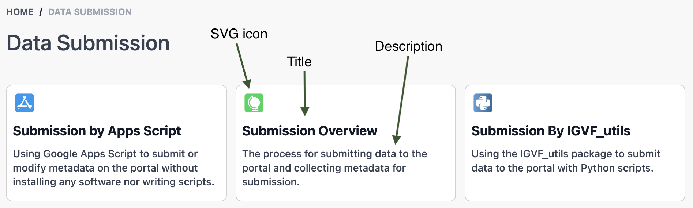

# Button Navigation Component BUTTON_NAV

This component shows a set of buttons used to navigate to other pages or other web sites.



## Overview

All the properties of this page component define the title, page link, description, and an SVG icon for the button. The buttons appear side by side with a maximum of three per row, with additional buttons wrapping to subsequent rows of buttons until all buttons render. The number of buttons in a row vary depending on the width of the container.

The link can take either of these two forms:

- An external site, e.g. `https://encodeproject.org/`
- An internal page, e.g. `/help/submission-tips/`

External sites load in a new tab. Internal pages simply replace the current page.

Here’s the overall format for a button navigation area for a single button. All of this is required.

```
BUTTON_NAV
{button title}={path or URL}|{icon SVG ID}|{description markdown}
#{icon SVG ID}=<single-line of icon SVG>
```

Notice you have two types of lines, both required:

1. Button definition — starts with a title
1. Icon definition — starts with a #

If you define three buttons, you need to define three icons unless you have multiple buttons sharing the same icon.

## Example

```
BUTTON_NAV
First Topic Title=/topic/first|first-topic|Some explanatory for the first topic.
Second Topic Title=/topic/second|second-topic|The second topic’s markdown including `<code>`.
Third Topic Title=/topic/third|third-topic|The **third** topic’s markdown.
#first-topic=<svg>…</svg>
#second-topic=<svg>…</svg>
#third-topic=<svg>…</svg>
```

## Button Definition Properties

- **button title** — This goes on the left side of the equals sign. It appears as large bold text and shouldn’t contain more than a few words. Test with different window widths to make sure it doesn’t wrap, or if it does, you’re OK with it.

- **path or URL** — This specifies the complete URL for external web sites, or the path for internal pages. Don’t use a full URL for internal pages (e.g. `https://data.igvf.org/help/submission-tips/`) — use the page path instead (`/help/submission-tips/`). Using the full URL for an internal page loads that page in a new tab. Using the page path for internal pages loads only the smaller amount of data needed to render that page in the browser window with no HTML needed.

- **icon SVG ID** — To make these button definition lines manageable, SVG for the icons gets defined on their own lines. You give the id of the SVG that you provide later in this edit block. Generally use a shishkebab-case string for this ID, though really any string would work as long as it doesn’t contain the pipe character which the page-component mechanism uses to separate elements on the right side of the equals sign.

- **description markdown** — A markdown string for a short description of what the user can expect to find on the linked page. It supports full markdown, but try not to go much outside of the most basic markdown, if you use any markdown at all. Note that while links within the markdown will render as links, the user can’t click them because they get overridden by the link for the entire button.

## SVG Definitions

These lines attach the icon SVG IDs that you entered on the button definition lines with their corresponding SVG XML code. Start the line with the pound sign to indicate that this line defines an SVG icon, and immediately follow that with the icon SVG ID for a single icon. An equals sign follows, and the SVG XML follows that. The SVG XML has to have no line breaks — all of it has to exist on one line. You can delete lines that some SVG editors include, like `<?xml version="1.0" encoding="UTF-8"?>`. The `<svg>` tag really only needs the `viewBox` value. You can delete everything else. Extra spaces in the XML don’t matter as long as everything exists on one line.

## Borderless Pages

This component can look better on a page without the white panel with a gray border (in light mode). You can make a page appear without this panel by adding `[nopanel]` to the end of the page title, separated from the visible part of the title with a space. This `[nopanel]` code does not appear in the page title nor in the breadcrumbs.
