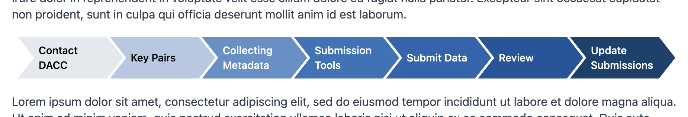

# Chevron Component CHEVRON_NAV

This component places a horizontal navigation area into the page made up of horizontal chevrons, each with a specified color, letting you link each item to an external website, an internal page, or an anchor elsewhere on the page. The color of the text within gets set to black or white automatically based on the luminance of the background color you chose for each link.



## Properties

All the properties of this page component define the titles, corresponding links, and chevron colors so you can have essentially any number of properties (menu items) you want. All the properties appear as `Title=link|color`, where the title specifies what the reader sees as a menu item, and clicking it goes to the link.

This menu acts responsively, adapting to the width of the viewport or container. Keep that in mind as you add more menu items that the items within could wrap to a second line, and then as many lines of links as needed to fit within the available width.

The link can take any of these three forms:

- An external site, e.g. `https://encodeproject.org/`
- An internal page, e.g. `/tissues/`
- An anchor on the page, e.g. `#tissue-biosamples`

Don’t use a full URL for internal pages (pages that exist in igvf-ui) — use the page path instead. Using the full URL loads all the HTML for the page (needed for external sites), while using the page path loads only the smaller amount of data needed to render that page with no HTML needed.

Specify the required color of each button after a pipe character following the link. Use hex colors without the leading hash mark (#).

### Anchors

You can link to a section elsewhere on the same page for the reader’s convenience. You make anchors using the `<a>` HTML tag at the location on the page that you want to link to and choosing a meaningful anchor name that suits a URL, so don’t go delving into spaces and special characters for the anchor name. You normally use only alphanumerics and dashes for anchor names. Here, an anchor named `tissue-biosamples` gets inserted before a level 2 header:

```
<a name="tissue-biosamples"></a>
## Tissue Biosamples
```

You can then use `#tissue-biosamples` as the link to have the browser scroll to this spot.

```
CHEVRON_NAV
Tissue Biosamples=#tissue-biosamples
```

## Example

```
CHEVRON_NAV
First Topic=#first-topic|404080
Second Topic=/tissues/IGVFSM0000DDDD|c0c020
Third Topic=#third-topic|208c4f
Fourth Topic=https://www.genome.gov/|72c6c2
Fifth Topic=#fifth-topic|c92020
...
<a name="first-topic"></a>
...
<a name="third-topic"></a>
...
<a name="fifth-topic"></a>
```

“First Topic,” “Third Topic,” and “Fifth Topic” link to their anchors on the same page, so clicking them simply scrolls the page to those locations. “Second Topic” links to the IGVFSM0000DDDD tissue page on this site. “Fourth Topic” links to the NHGRI website.
