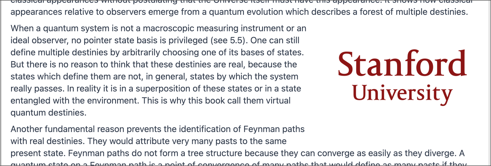
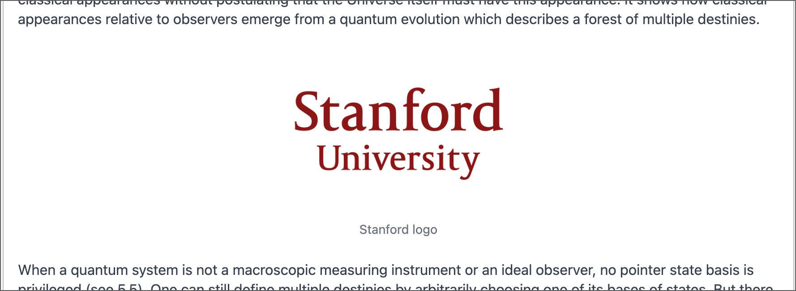

# Page Component IMAGE_ALIGNED

This convenience component lets you include an image in your Markdown document with a specific width and aligned to the left, center, or right of the page. If you want your image to span the full width of the text, use the Markdown image syntax instead.

## Properties

**`src`** — required

Specify the URL or path of the image to include. For images hosted on other domains, pass the full URL of the image:

```
src=https://identity.stanford.edu/wp-content/uploads/sites/3/2020/07/stanford-university-stacked.png
```

You can also specify a path for images in this repo. Include these images in the `/public/pages/` directory of this repo, then use the path `/pages/example-image.png`:

```
src=/pages/example-image.png
```

You can use JPEG, PNG, and SVG files for the `src` property.

**`alt`** — required

Give the alt text for the image in this property. This text describes the image so that people using screen readers can hear this description of the image:

```
alt=Stanford logo
```

If you don’t provide this property, no image appears on your page.

**`align`** — optional — "center" default

Specifies the horizontal alignment of the image on the page. It can have any of the three following values:

`left` — Image appears on the left side of the page with following text flowing around it to its right and below.

`center` — Image appears horizontally centered on the page. The spaces to the left and right appear empty. Default value if you do not provide an `align` property.

`right` — Image appears on the right side of the page with following text flowing around it to its left and below.

Other values produce undefined results.

**`width`** — optional — "100%" default

Specifies the width of the image as a percent or pixels:

```
width=50%
```

You can also use CSS `px` units, but be very careful because if the window width gets too narrow to fit an image of this width, the image overflows the page panel. Using a percent always keeps the image within the panel’s bounds. You could also use other CSS units, but be sure to test them at different widths to make sure they don’t overflow.

**`caption`** — optional — No default

Specifies a centered caption that appears just below your image. If you don’t provide this property, no caption appears below the image.

```
caption=Figure 5: Stanford logo
```

The caption appears with gray, slight smaller-than-normal centered text.

## Example 1

This shows the Stanford logo floated to the right with a 33% width and no caption. The IMAGE_ALIGNED component block appears before the paragraph starting, “When a quantum system…” in the page editor:

```
IMAGE_ALIGNED
src=https://identity.stanford.edu/wp-content/uploads/sites/3/2020/07/stanford-university-stacked.png
alt=Stanford logo in red
width=33%
align=right
```



## Example 2

This shows the Stanford logo center aligned with a 33% width and a caption:

```
IMAGE_ALIGNED
src=https://identity.stanford.edu/wp-content/uploads/sites/3/2020/07/stanford-university-stacked.png
alt=Stanford logo in red
caption=Stanford logo
width=33%
```


