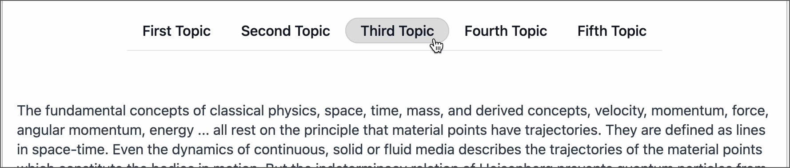

# Page Component PAGE_NAV

This convenience component places a horizontal navigation area into the page, letting you link each item to an external website, an internal page, or an anchor elsewhere on the page.



## Properties

All the properties of this page component define the titles and corresponding links, so you can have essentially any number of properties you want. All the properties appear as `Title=link`, where the title specifies what the reader sees as a menu item, and clicking it goes to the link.

The link can take any of these three forms:

- An external site, e.g. `https://encodeproject.org/`
- An internal page, e.g. `/tissues/`
- An anchor on the page, e.g. `#tissue-biosamples`

Don’t use a full URL for internal pages (pages that exist in igvf-ui) — use the page path instead. Using the full URL loads all the HTML for the page (needed for external sites), while using the page path loads only the smaller amount of data needed to render that page with no HTML needed.

### Anchors

You can link to a section elsewhere on the same page for the reader’s convenience. You make anchors using the `<a>` HTML tag at the location on the page that you want to link to and choosing a meaningful anchor name that’s suitable for a URL, so don’t go delving into spaces and special characters for the anchor name. You normally use only alphanumerics and dashes for anchor names. Here, an anchor named `#tissue-biosamples` gets inserted before a level 2 header:

```
<a href="#tissue-biosamples"></a>

## Tissue Biosamples
```

You can then use `#tissue-biosamples` as the link to have the browser scroll to this spot.

## Example

This example makes the page navigation that appears at the top of this document.

```
PAGE_NAV
First Topic=#first-topic
Second Topic=/tissues/IGVFSM0000DDDD
Third Topic=#third-topic
Fourth Topic=https://www.genome.gov/
Fifth Topic=#fifth-topic
```

“First Topic,” “Third Topic,” and “Fifth Topic” link to their anchors on the same page, so clicking them simply scrolls the page to those locations. “Second Topic” links to the IGVFSM0000DDDD tissue page on this site. “Fourth Topic” links to the NHGRI website.
