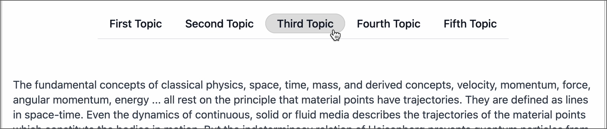

# Page Component PAGE_NAV

This convenience component places a horizontal navigation area into the page, letting you link each item to an external website, an internal page, or an anchor elsewhere on the page.



## Properties

All the properties of this page component define the titles and corresponding links, so you can have essentially any number of properties you want. All the properties appear as `Title=link`, where the title specifies what the reader sees as a menu item, and clicking it goes to the link.

The link can take any of these three forms:

- An external site, e.g. `https://encodeproject.org/`
- An internal page, e.g. `/tissues/`
- An anchor on the page, e.g. `#tissue-biosamples`

Don’t use a full URL for internal pages (pages that exist in igvf-ui) — use the page path instead. Using the full URL loads all the HTML for the page (needed for external sites), while using the page path loads only the smaller amount of data needed to render that page with no HTML needed.

### Anchors

You can link to a header (`#`, `##`, etc.) elsewhere on the same page for the reader’s convenience. You add anchor tags by adding an anchor tag that looks like `{#tissue-biosamples}` to the end of the header line. You must separate the tag from the rest of the title with white space, an open brace, hash, then the kebab case ID you want for that tag which must be unique on the page. Here, an anchor named `tissue-biosamples` gets added to a level 2 header. The anchor tag must be separated from the header text with white space, normally a single space. Nothing can follow the anchor tag on the line, including whitespace. If the anchor tag doesn’t follow these rules, it appears as part of the header text and no anchor is generated in the HTML.

```
## Tissue Biosamples {#tissue-biosamples}
```

You can then use `#tissue-biosamples` as the link to have the browser scroll to this spot.

```
PAGE_NAV
Tissue Biosamples=#tissue-biosamples
```

## Example

```
PAGE_NAV
First Topic=#first-topic
Second Topic=/tissues/IGVFSM0000DDDD
Third Topic=#third-topic
Fourth Topic=https://www.genome.gov/
Fifth Topic=#fifth-topic
...
## First Topic {#first-topic}
...
### Third Topic {#third-topic}
...
## Fifth Topic {#fifth-topic}
```

“First Topic,” “Third Topic,” and “Fifth Topic” link to their anchors on the same page, so clicking them simply scrolls the page to those locations. “Second Topic” links to the IGVFSM0000DDDD tissue page on this site. “Fourth Topic” links to the NHGRI website.
