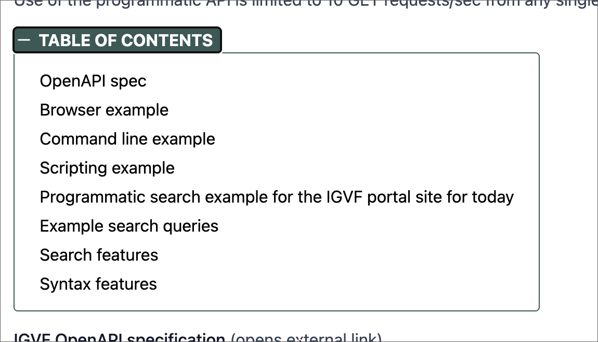

# Page Component TOC_NAV

This page component places a collapsible navigation area into the page, letting you link each item to an anchor on the page. This component isn’t intended to link to other pages nor external pages.



When the page loads the menu does not appear; only “TABLE OF CONTENTS” appears preceded by a plus sign. Clicking this button makes the menu appear.

Compare this with PAGE_NAV. That horizontal menu is best when you have just a few links with short titles. It can also link to other pages and external pages, unlike TOC_NAV. TOC_NAV is best if you have several items on the page to link to, or they have long titles that make PAGE_NAV look awkward.

## Properties

All the properties of this page component define the titles and corresponding links, so you can have essentially any number of properties you want. All the properties appear as `Title=link`, where the title specifies what the reader sees as a menu item, and clicking it goes to the link.

The anchor link must appear preceded by a pound sign, e.g. `#tissue-biosamples`

Don’t use a full URL for internal pages (pages that exist in igvf-ui) — use the page path instead. Using the full URL loads all the HTML for the page (needed for external sites), while using the page path loads only the smaller amount of data needed to render that page with no HTML needed.

### Anchors

You can link to a header (`#`, `##`, etc.) elsewhere on the same page for the reader’s convenience. You add anchor tags by adding an anchor tag that looks like `{#tissue-biosamples}` to the end of the header line. You must separate the tag from the rest of the title with white space, an open brace, hash, then the kebab case ID you want for that tag which must be unique on the page. Here, an anchor named `tissue-biosamples` gets added to a level 2 header. The anchor tag must be separated from the header text with white space, normally a single space. Nothing can follow the anchor tag on the line, including whitespace. If the anchor tag doesn’t follow these rules, it appears as part of the header text and no anchor is generated in the HTML.

```
## Tissue Biosamples {#tissue-biosamples}
```

You can then use `#tissue-biosamples` as the link to have the browser scroll to this spot.

```
TOC_NAV
Tissue Biosamples=#tissue-biosamples
```

## Example

```
TOC_NAV
OpenAPI Spec=#open-api-spec
Browser Example=#data-in-browser
Command Line Example=#json-command-line
Scripting Example=#json-script
Programmatic Search Example for the IGVF Portal Site for Today=#programmatic-search
Example search queries=#search-examples
Search features=#search-features
Syntax features=#syntax-features
...
## OpenAPI Spec {#open-api-spec}
...
## Browser Example {#data-in-browser}
...
And so on…
```
