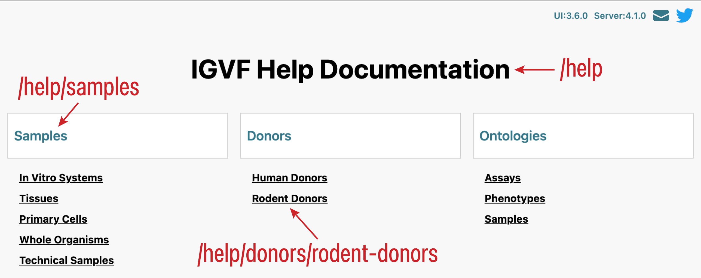

# Guide to Creating, Editing, and Organizing Help Pages

Help pages have `/help` as a parent or grandparent page, but they otherwise have nothing special about them. They still largely contain Markdown, they can contain multiple blocks of Markdown and page components, and can have an optional lab and award.

The page at `/help` gets generated from all pages that have `/help` at the start of their paths. They appear as a hierarchy starting with the root help page, categories within the help page, and help pages within each category.

For the Help page to display any content at all, you must have a root help page and at least one help category page.

## The Root Help Page

The title of the page with the `/help` path gets used as the main `h1` title that appears top and center on the Help page. It also serves at the parent page for the help-category pages described in the next section. None of its content gets displayed on the Help page, so you can keep it empty of content.

## Help Category Pages

The Help page gets divided up into categories, each of which has a title and a set of help pages under it. Any page with `/help` as its direct parent page gets used as a category page.

The title of each help category page gets used as the title of the corresponding category on the Help page. None of the contents of a help category page gets displayed on the help page, so you can keep them empty of content.

## Help Content Pages

These pages hold the actual help text. Each one has a category page (described in the previous section) as its parent page. Edit these pages as you would any non-help page, and links to their pages show up under their parent category. The following image shows an example of how these pages under `/help` appear on the Help page.

## Ordering Categories and Pages

The categories and the pages appearing under each category appear in the order igvfd returns them. This might not match the order you want, so you can use an optional mechanism to specify the order of the categories and the order of the pages under each category.

To order the categories, end the title of the category page with two left square brackets, a number, and two right square brackets. This number, called the “ordering number,” specifies the position this category appears relative to the ordering numbers of other category pages. For example, we have the following category pages that appear in this order from igvfd (title — path):

1. Samples — /help/samples
1. Donors — /help/donors
1. Ontologies — /help/ontologies

If you change their titles to end in an ordering number, they appear by this order:

1. Donors [[10]] — /help/donors
1. Ontologies [[20]] — /help/ontologies
1. Samples [[45]] — /help/samples

You apply this same scheme to individual help pages to specify the order that they appear under a category.

Using a non-contiguous ordering number sequence — i.e. putting gaps between the ordering numbers (e.g. 10, 20, 45) — allows you to easily insert other pages into the order without having to renumber several pages’ ordering numbers after the new pages. For example, if you need to insert a new page between “Donors” and “Ontologies” in the above example, you can use 15 for its ordering number. Having generous gaps in your ordering-number sequence gives you flexibility when adding new categories or new help pages to a category.

Though the ordering number forms a part of a page’s title, the ordering numbers never appear on the Help page, individual help pages, the page breadcrumbs, nor in the page’s tab title. They appear if you go to `/search?type=Page`.

If you have a combination of help categories or help pages with and without ordering numbers, the pages without ordering numbers appear after all the pages with ordering numbers, and in the order igvfd returned them.

Supressing the display of ordering numbers in page titles only applies to help pages. If you happen to have an ordering number on a non-help page, it gets displayed in the page title and doesn’t affect the order they appear anywhere they would appear.
