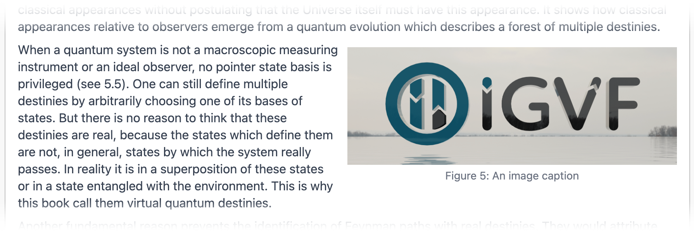

# Page Editor’s Guide

This guide gives an overview of creating and editing pages in the igvf-ui/igvfd system.

## Editing Existing Pages

You can edit pages by going to that page and clicking the Edit Page button in the upper-left corner of the content. The editor has two main sections:

1. One or more text blocks
1. A page metadata editor that applies to the entire page

### Text blocks

Enter the content for the page in the text-entry areas of these text blocks using standard [Markdown](https://www.markdownguide.org/basic-syntax/) which get rendered as styled text.

Below the text-entry areas you find a set of tools:

1. Block type
1. Text language direction
1. Markdown preview
1. Action to add a text block above the current one
1. Action to add a text block below the current one
1. Action to delete the current text block.

#### Block Type Tool

By default, each block holds Markdown text. But you can have any block specify a React component to display at that location on the page by setting its block type to “Component” in this dropdown menu. You then specify which component you want and any extra data that particular component needs in the text-entry area instead of Markdown. You can read more details about this in the [Page Components](#page-components) section below.

#### Text Language Direction

Use these buttons to specify that this text block holds the usual left-to-right language or a right-to-left language like Hebrew or Arabic. Do not use this to right-justify text — use this only for right-to-left languages. You can mix left-to-right and right-to-left language blocks on one page.

If you have the Component block type set, these buttons disappear because this control only works for Markdown text.

#### Markdown Preview

Click this toggle on Markdown blocks to see a preview of what the Markdown text in this text block will look like when people view this page. Click the button again to turn off the preview and get back to editing.

If you have the Component block type set, this button disappears — you can only preview Markdown text.

#### Add Block Above / Below

Use these buttons to insert a new text block either above or below the current block. You can have a maximum of 20 text blocks on a page. Once you have 20 blocks on the page, all the Add Text Block buttons disappear.

#### Delete Block

Click this button to delete the current block. You get a chance to cancel this action in case you click this button accidentally. If you have only one block on the page, this button disappears.

### Metadata Editor

The bottom of the page editor has the metadata editor that controls aspects of the page as a whole. The following sections describe each aspect.

#### Name

This required field specifies the last element of the page’s path (URL). For example, if you want to have the page at the path `/top-level/mid-level/this-page`, then put `this-page` into the Name field.

This field only accepts characters that work in a URL, so typing a disallowed character results in a dash instead. Only letters, numbers, dashes, and underscores get accepted without getting converted to dashes. You can’t have more than one dash consecutively. If you try, every dash or other character converted to a dash gets ignored.

You cannot have two pages with the same name throughout the system. This applies even if the two pages have different paths. Even if you delete a page, you cannot use its name for any other page in the system. Also don’t use the name of an existing non-documentation page, `primary-cells` for example. Doing this could make the original page inaccessible. So put some thought into every page’s name to reduce annoying issues going forward.

#### Title

Enter the page’s title into this required field. This appears at the top of the page, on the Page collection page, and for help pages it appears in the help directory.

#### Status

Set the status in this dropdown menu. You can delete pages with this, making them inaccessible to all but admins.

#### Parent

You can set the last element of a page’s path through its name. You set the rest of the path in this Parent field. The parent pages must exist already to appear in this field. For example, if you want to have a page at the path `/samples/biosamples/primary-cells`, you’d first create a page with the name `samples` and with no parent, then another page with the name `biosamples` and make `/samples/` its parent. Then make a page with the name `primary-cells` and make `/samples/biosamples/` its parent.

Pages without parents appear at a top-level path, such as `/samples/` in the above example. If you select a parent and then change your mind and want to have the page at the top level, just click the parent you selected again, leaving no parent selected.

#### Award

Select an award for the page with this optional field. If you select an award and change your mind and want no award, just click the award you selected again, leaving no award selected.

#### Lab

Select a lab for the page with this optional field. If you select a lab and change your mind and want no lab, just click the lab you selected again, leaving no lab selected.

### Saving the page

Saving the page makes the page appear in its public form. If you changed the name or parent of the page, you see the page appear at its new path.

If you click the Cancel button instead, you see the page before your edits appear in its public form.

Be very careful while editing a page not to navigate away from the page. You get no warning that you will lose changes — you simply navigate to the new page and lose all your changes. You only get a warning about unsaved changes if you reload the page or close the tab. Adding a warning for navigating away from the page requires new capabilities in the software platform igvf-ui uses.

## Adding New Pages

You create new pages by going to the Pages menu in the site navigation list to see a list of all existing pages. At the upper-right corner of the list, click the “Add Page” button in the upper-right corner of the list. You then see the same page editor as you see when you edit an existing page.

## Help Page

The Help menu at the bottom of the navigation area goes to a generated help directory. The help pages on this page have a hierarchy with top-level help pages and their child pages listed under them.

See help-page-guide.md in this directory for a detailed guide for help pages.

<a name="images"></a>

## Images

Markdown provides an easy way to insert full-width images into your page:

```

```

Make sure to include a short description of every image in the image alt text, because screen readers verbalize these for people with visual impairments.

You can pass the full URL of an image in the `src` property to display an image hosted on another website or stored in AWS. If you instead use an image committed to the igvf-ui repo, place the image into the /public/pages directory. Then use the path `/pages/image-file-name.png`.

If you use an SVG or a PNG with a transparency, test how your image appears in dark mode to make sure people can still see your image against the dark background.

If you want images to float left or right, or to appear centered between paragraphs, use the IMAGE_ALIGNED page component. This lets you specify the alignment and width of images, as well as supplying an optional caption. For example:

```
IMAGE_ALIGNED
src=/pages/igvf-3d-logo.png
alt=3D IGVF logo floating above water
align=right
width=50%
caption=Figure 5: An image caption
```

This results in a right-aligned image with a caption covering 50% of the width of the page, and with the following text wrapping around the image:



Make sure you have enough text in following text blocks to wrap around the entire height of the image or else the image could go past the bottom of the page. Make sure to test this at different browser widths, including mobile widths.

See the [IMAGE_ALIGNED page component](../components/page-components/docs/image-aligned.md) for more details.

<a name="page-components"></a>

## Page Components

As mentioned previously, text blocks come up with the Markdown type by default to hold Markdown text. But you can configure any text block with the Component type. The text block then contains text in a specific format to render something Markdown can’t, such as dynamic content. Other page components might instead simplify something you can already do in Markdown.

The first line of a Component block contains the name of the page component you want displayed at this point on the page. This normally appears in all caps, possibly with underscores between words. In the [Images](#images) section above, you see the `IMAGE_ALIGNED` page component name.

Follow this with required and optional properties to affect the display of the page component. These have the form `propertyName=Property Value`. Each page component takes a different set of properties. See the Markdown files in the components/page-component/docs directory for details about each page component.

## Anchors

You can mark anchors on the page that you can link to so that the page scrolls to that part of the page when the user clicks on a link elsewhere on the page or just from its URL. Each anchor on a page needs a unique name.

To mark an anchor, use an empty link text, and a unique anchor string as the link, such as:

```
[](unique-anchor)
```

To link to this anchor, use the same unique anchor with a hash as the link. For example, you can link to the anchor above with the following link:

```
[Link Text](#unique-anchor)
```
